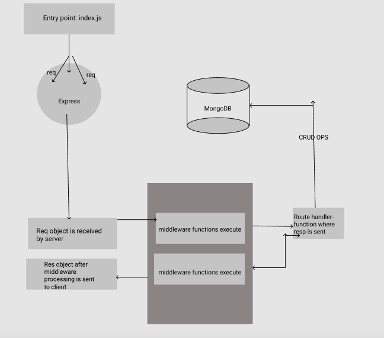

# api-server
## Lab-06

**Author: Riva Davidowski**

#### This app is all about building a dynamic API

**Phase 1 Requirements:**

- Build a simple API (with no code) to gain some clarity and visuals on proper route structure and the data contracts.
- Use ‘json-server’ to build a simple API server that fulfills all of our business requirements in a “sandbox”
- Specifically, we will be building an API to serve data for a virtual storefront, which displays categories and products to a potential shopper

*For the first phase, this API will perform CRUD operations using ReST methods on 2 data models using json-server, an installable and configurable API application used to “spin up” servers for testing purposes.*

** Phase 2 Requirements:**

- Previously,  json-server did a great job of serving as a “mock” API server for our application. In this phase ,we begin the transition towards making a “real” API server. Specifically, replicating the same functionality json-server provided is done by writing our own server, using Express and Node.js

## Setup

### How to initialize/run the application:
**The following software is required to be installed on your system:**

- Install npm: `npm i -g` and then use  `npm init`
- Install json-server: `npm install json-server`
    - Create a `db.json` file with some data
    - Start JSON Server: `json-server --watch db.json`
    - Note that json-server does not validate your data, it’ll just save whatever you send it.
    - Visit [npmjs.com](https://www.npmjs.com/package/json-server) for more info
- Use httpie (command line), Insomnia, Postman, or any other “ReST” testing application to POST some categories and products, using JSON, into your API so you have data to work with.
- install `express`
- import express : `const express = require('express');
- Execute express: `const app = express(); `

- **The entry point for this app is: `index.js`**
- Start server:
```
    /* give it a port number and optionally pass a function to call when app
     starts listening on given port*/

const port = process.env.PORT || 3000;
app.listen(port, () => console.log(`Listening on port ${port}`));

```

- Install MongoDB: `npm install mongodb`
- Install mongoose: `npm install -save--dev mongoose`
- Visit [docs.mongodb.com](https://docs.mongodb.com/manual/tutorial/getting-started/) to learn How to get started using MongoDB.
- Connect to your db:

```

//Connect to Database
mongoose.connect(process.env.MONGODB_URI,{useNewUrlParser:true, useUnifiedTopology: true} )
    .then(() => console.log('Connected to MongoDB...'))
    .catch(err => console.error('Could not connect to MongoDB...',err));

```


### Testing:

**Phase 1:**

- Create an account at swagger.io and used the Inspector application to test api
- Wrote and published swagger documentation with Swagger Inspector, this published it to Swagger Hub
- Converted the `YAML` to `JSON` and then copied and pasted swagger.json from the editor and add to your server project.

**Phase 2:**

- install `supertest`: `npm install supertest`
- install `jest`: `npm install jest`
- install `supergoose`

### How it works:



